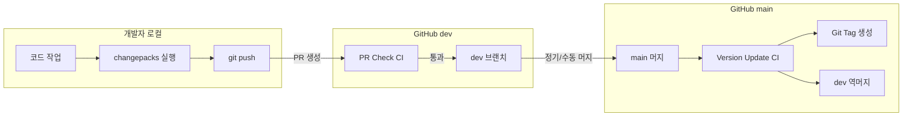
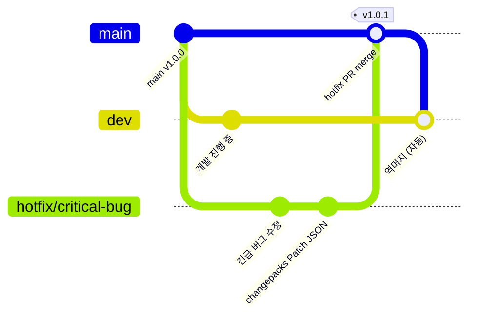
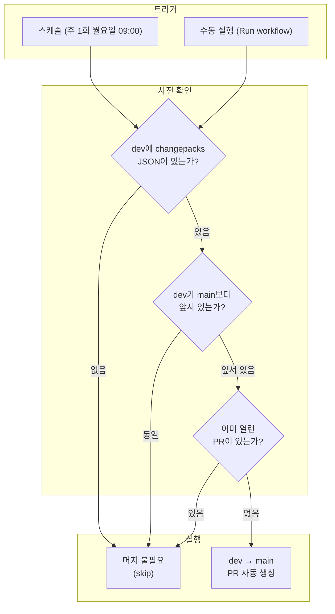
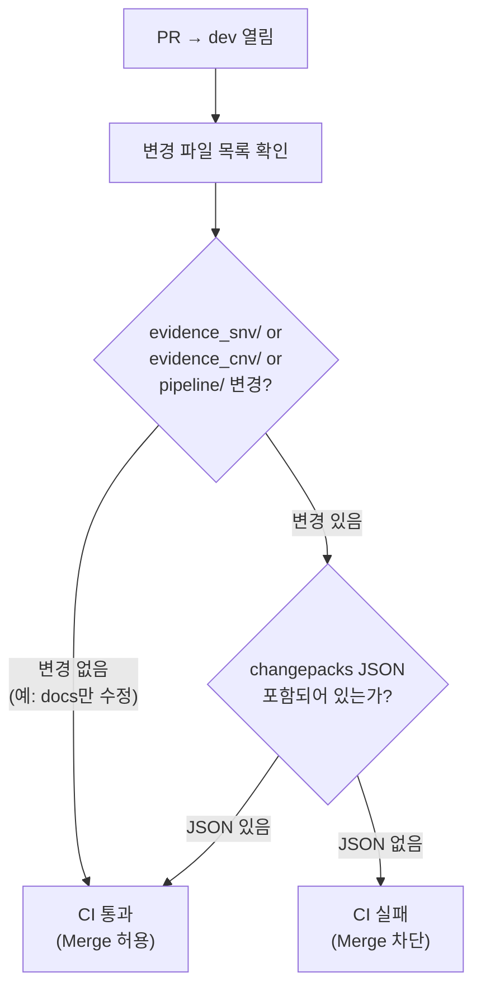
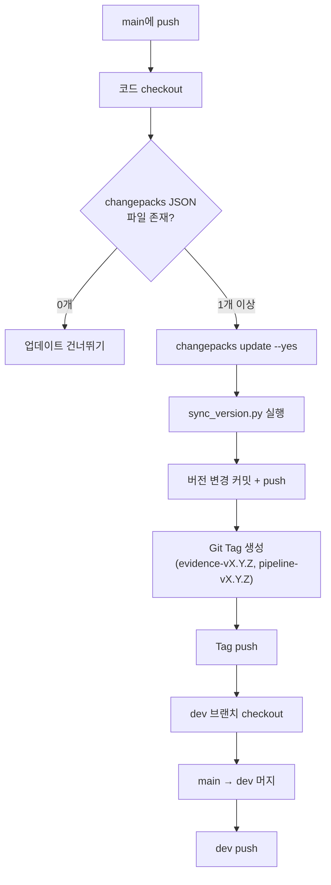

# Changepacks 설정 및 사용 가이드

**대상**: EVIDENCE 개발팀  
**목적**: Changepacks 기반 유의적 버저닝(Semantic Versioning) 도입을 위한 설정 방법, 사용법, CI 자동화 흐름 안내

---

## 목차

1. [전체 워크플로우 개요](#1-전체-워크플로우-개요)
2. [브랜치 전략 및 머지 흐름](#2-브랜치-전략-및-머지-흐름)
3. [초기 설정](#3-초기-설정)
4. [Changepacks 사용법 (상세)](#4-changepacks-사용법-상세)
5. [CI 자동화 파이프라인](#5-ci-자동화-파이프라인)
6. [시나리오별 작업 흐름](#6-시나리오별-작업-흐름)
7. [주의사항 및 FAQ](#7-주의사항-및-faq)

---

## 1. 전체 워크플로우 개요



**한 줄 요약**: 작업자는 `changepacks` 명령어 한 번만 실행하면, 나머지(버전 업데이트, 태그, 역머지)는 CI가 자동 처리한다.

---

## 2. 브랜치 전략 및 머지 흐름

### 2-1. 일반 개발 흐름 (local → dev → main)

```mermaid
gitGraph
    commit id: "main v1.0.0"
    branch dev
    checkout dev
    commit id: "dev 초기"
    branch feat/snv-filter
    checkout feat/snv-filter
    commit id: "코드 작업"
    commit id: "changepacks JSON"
    checkout dev
    merge feat/snv-filter id: "PR merge → dev" tag: "JSON 누적"
    branch feat/cnv-report
    checkout feat/cnv-report
    commit id: "코드 작업 2"
    commit id: "changepacks JSON 2"
    checkout dev
    merge feat/cnv-report id: "PR merge → dev" tag: "JSON 2개 누적"
    checkout main
    merge dev id: "정기 머지" tag: "v1.1.0"
    checkout dev
    merge main id: "역머지"
```

**흐름 요약:**

| 단계 | 누가 | 어디서 | 무엇을 |
|------|------|--------|--------|
| 1 | 작업자 | 로컬 | `dev`에서 feature 브랜치 생성, 코드 작업 |
| 2 | 작업자 | 로컬 | `changepacks` 실행 → JSON 생성 → 커밋 |
| 3 | 작업자 | GitHub | `feat/*` → `dev` PR 생성 |
| 4 | CI | GitHub | Changepacks Check (JSON 존재 확인) |
| 5 | 리뷰어 | GitHub | PR 리뷰 → Merge |
| 6 | CI | GitHub | 정기 스케줄 or 수동으로 `dev` → `main` PR 생성 |
| 7 | CI | GitHub | `main` 머지 시 버전 업데이트 + Tag + dev 역머지 |

### 2-2. 핫픽스 흐름 (main → hotfix → main → dev)



**핫픽스 절차:**

| 단계 | 작업 |
|------|------|
| 1 | `main`에서 `hotfix/이슈명` 브랜치 생성 |
| 2 | 버그 수정 + `changepacks` 실행 (Patch) |
| 3 | `hotfix/*` → `main` PR 생성 → merge |
| 4 | CI가 자동으로: 버전 Patch bump + Tag + `main` → `dev` 역머지 |

### 2-3. CI 자동 배포 흐름 (dev → main 정기 머지)



---

## 3. 초기 설정

### 3-1. Changepacks 설치

```bash
# cy2 서버에서 실행
pip install changepacks
```

설치 확인:

```bash
changepacks --version
# changepacks x.x.x
```

### 3-2. 프로젝트 초기화

프로젝트 루트에서 한 번만 실행 (이미 설정된 경우 건너뛰기):

```bash
changepacks init
```

생성되는 파일: `.changepacks/config.json`

```json
{
  "baseBranch": "dev",
  "ignore": [
    "genet/**"
  ]
}
```

| 설정 | 설명 |
|------|------|
| `baseBranch` | changepacks가 비교할 기준 브랜치. `dev`로 설정 |
| `ignore` | 버전 추적에서 제외할 디렉토리 패턴 |

### 3-3. 패키지 등록

changepacks는 `pyproject.toml` 파일이 있는 디렉토리를 패키지로 인식한다.

```
프로젝트 루트/
├── evidence/pyproject.toml     ← evidence 패키지 (v3.0.0)
└── pipeline/pyproject.toml     ← pipeline 패키지 (v1.0.3)
```

각 `pyproject.toml`의 최소 내용:

```toml
[project]
name = "evidence"
version = "3.0.0"
```

> evidence_snv/, evidence_cnv/ 디렉토리의 변경은 모두 `evidence` 패키지의 버전에 반영된다.

### 3-4. GitHub Actions 설정

`.github/workflows/` 아래 3개의 워크플로우 파일이 필요하다:

| 파일 | 트리거 | 역할 |
|------|--------|------|
| `pr-changepacks-check.yaml` | PR → dev | 추적 디렉토리 변경 시 changepacks JSON 존재 확인 |
| `version-update.yaml` | push → main | `changepacks update` 실행, version.py 갱신, Tag 생성, dev 역머지 |
| `scheduled-merge.yaml` | 스케줄 / 수동 | dev → main PR 자동 생성 (changepacks JSON 존재 시) |

### 3-5. GitHub 저장소 설정

GitHub 저장소 Settings에서 아래를 설정해야 한다:

1. **Settings → Actions → General → Workflow permissions**
   - "Read and write permissions" 선택
   - "Allow GitHub Actions to create and approve pull requests" 체크

2. **Settings → General → Pull Requests**
   - "Automatically delete head branches" 체크 (권장)

---

## 4. Changepacks 사용법 (상세)

### 4-1. 언제 실행하는가?

```
코드 작업 완료 → 리뷰 통과 → changepacks 실행 → 커밋 → push → PR merge
```

**리뷰가 끝나고 "이제 머지해도 되겠다"** 싶을 때 실행한다.  
리뷰 과정에서 코드가 바뀔 수 있으므로, 너무 일찍 실행할 필요가 없다.

### 4-2. 실행 명령어

```bash
cd /path/to/project-root
changepacks
```

### 4-3. 인터랙티브 인터페이스 상세 가이드

`changepacks` 명령을 실행하면 3단계의 인터랙티브 선택 화면이 나타난다.

#### Step 1: 버전 등급 선택 (Major / Minor / Patch)

```
? Select projects to update for Major
  [ ] [Python] evidence (v3.0.0) - evidence/pyproject.toml
  [ ] [Python] pipeline (v1.0.3) - pipeline/pyproject.toml
```

화면 상단에 현재 버전 등급이 표시된다. 처음에는 **Major**부터 시작한다.

**조작 방법:**

| 키 | 동작 |
|----|------|
| `↑` / `↓` (위/아래 방향키) | 패키지 항목 이동 |
| `Space` (스페이스바) | 현재 항목 선택/해제 (`[ ]` ↔ `[x]`) |
| `Enter` (엔터) | 현재 등급의 선택을 **확정**하고 다음 등급으로 이동 |

**동작 흐름:**

```
[Major 선택 화면]
  아무것도 선택하지 않고 Enter
    ↓
[Minor 선택 화면]
  아무것도 선택하지 않고 Enter
    ↓
[Patch 선택 화면]
  → 여기서 evidence를 Space로 선택 → Enter
```

**예시: evidence를 Patch로 선택하는 경우**

```
──────────────────────────────────────────────
 Step 1-a: Major 선택 화면

 ? Select projects to update for Major
   [ ] [Python] evidence (v3.0.0)
   [ ] [Python] pipeline (v1.0.3)

 → 아무것도 선택하지 않음 → Enter 입력
──────────────────────────────────────────────
 Step 1-b: Minor 선택 화면

 ? Select projects to update for Minor
   [ ] [Python] evidence (v3.0.0)
   [ ] [Python] pipeline (v1.0.3)

 → 아무것도 선택하지 않음 → Enter 입력
──────────────────────────────────────────────
 Step 1-c: Patch 선택 화면

 ? Select projects to update for Patch
 > [x] [Python] evidence (v3.0.0)    ← Space로 선택
   [ ] [Python] pipeline (v1.0.3)

 → Enter 입력
──────────────────────────────────────────────
```

> Major를 선택하고 싶다면 Step 1-a에서 Space로 해당 패키지를 선택 후 Enter.
> 하나의 패키지는 **하나의 등급에만** 선택할 수 있다.
> 여러 패키지를 동시에 선택할 수 있다 (예: evidence는 Minor, pipeline은 Patch).

#### Step 2: 변경 노트 작성

```
? Write your change note:
  ▊
```

변경 내용을 한 줄로 입력한다. 작성 후 `Enter`로 확정.

**권장 형식:**

```
[버전등급 의미]: 변경 내용 요약
```

**예시:**

```
fix: SnvAnalyzer genome_build 유효성 검증 추가
feat: CNV 분석 요약 리포트 함수 추가
BREAKING: SnvAnalyzer 생성자를 config dict 방식으로 변경
```

#### Step 3: 완료

changepacks가 자동으로 JSON 파일을 생성한다:

```
Created: .changepacks/changepack_log_Gi_gYlDoFYHalbzPfyD4P.json
```

### 4-4. 생성되는 JSON 파일

```json
{
  "changes": {
    "evidence/pyproject.toml": "Patch"
  },
  "note": "fix: SnvAnalyzer genome_build 유효성 검증 추가",
  "date": "2026-03-25T08:25:24.639Z"
}
```

| 필드 | 설명 |
|------|------|
| `changes` | 어떤 패키지(pyproject.toml)가 어떤 등급으로 변경되는지 |
| `note` | 작업자가 입력한 변경 노트 |
| `date` | 생성 시점 |

> 파일 이름이 랜덤 해시이므로 **여러 작업자가 동시에 작업해도 파일 충돌이 발생하지 않는다**.

### 4-5. JSON 커밋 및 Push

```bash
# JSON 파일을 스테이징
git add .changepacks/

# 코드 변경과 함께 커밋 (또는 별도 커밋)
git add -A
git commit -m "feat: SNV genome_build 검증 추가"

# push
git push -u origin feat/snv-quality-filter
```

> **중요**: `.changepacks/changepack_log_*.json` 파일이 커밋에 포함되지 않으면 PR Check CI가 실패하여 머지가 차단된다.

### 4-6. 버전 등급 선택 가이드

| 등급 | 의미 | 선택 기준 | 예시 |
|------|------|----------|------|
| **Major** | 하위 호환 깨짐 | 기존 API 제거/변경, DB 스키마 전면 수정 | 함수 시그니처 변경, 클래스 구조 전면 교체 |
| **Minor** | 하위 호환 유지하는 신규 기능 | 새 함수/클래스 추가, 새 옵션 파라미터 | 필터 함수 추가, 리포트 기능 추가 |
| **Patch** | 버그 수정, 소규모 개선 | 오타 수정, 유효성 검증 추가, 성능 개선 | docstring 수정, 예외 처리 보강 |

> **확신이 없으면 Patch를 선택하라.** 리뷰어가 등급 조정이 필요하다고 판단하면 JSON을 삭제 후 다시 실행하면 된다.

---

## 5. CI 자동화 파이프라인

### 5-1. PR Changepacks Check

**트리거**: `dev` 브랜치 대상 PR 생성/업데이트



**Merge 차단 시 CI 에러 메시지:**

```
::error:: evidence_snv, evidence_cnv, pipeline 디렉토리에 변경사항이 있지만
::error:: changepacks JSON 파일이 PR에 포함되어 있지 않습니다.
::error:: 머지 전에 'changepacks' 명령어를 실행하여 변경 로그를 생성해주세요.
```

**복구 방법:**

```bash
# 로컬에서 changepacks 실행
changepacks

# JSON 커밋 & push
git add .changepacks/
git commit -m "chore: add changepacks log"
git push

# → CI가 재실행되어 통과
```

### 5-2. Version Update (main push 트리거)

**트리거**: `main` 브랜치에 push (머지 포함)



**자동으로 처리되는 항목:**

| 동작 | 설명 |
|------|------|
| `changepacks update --yes` | JSON을 읽어 pyproject.toml 버전 갱신, JSON 파일 삭제 |
| `sync_version.py` | pyproject.toml → version.py 동기화 |
| 커밋 메시지 | `ci: version update - evidence vX.Y.Z, pipeline vX.Y.Z` |
| Git Tag | 새 버전이면 `evidence-vX.Y.Z`, `pipeline-vX.Y.Z` 태그 생성 |
| 역머지 | `main` → `dev` 자동 머지 (버전 변경 사항을 dev에 반영) |

### 5-3. Scheduled Merge (dev → main 정기 머지)

**트리거**: 스케줄 (운영: 주 1회 월요일 09:00 / 테스트: 5분마다) 또는 수동 실행

**수동 실행 방법:**
1. GitHub → Actions 탭
2. "Scheduled Dev to Main Merge" 워크플로우 선택
3. "Run workflow" 버튼 클릭

---

## 6. 시나리오별 작업 흐름

### 6-1. 일반 기능 개발

```bash
# 1. dev에서 feature 브랜치 생성
git checkout dev
git pull origin dev
git checkout -b feat/snv-quality-filter

# 2. 코드 작업
# ... (코드 수정) ...

# 3. 커밋
git add -A
git commit -m "feat: SNV quality filter 기능 추가"

# 4. changepacks 실행
changepacks
#   → Minor 선택 화면에서 evidence 선택
#   → 노트: "feat: SNV quality filter 기능 추가"

# 5. changepacks JSON 커밋
git add .changepacks/
git commit -m "chore: add changepacks log"

# 6. push & PR
git push -u origin feat/snv-quality-filter
# → GitHub에서 feat/snv-quality-filter → dev PR 생성
# → Changepacks Check CI 통과 확인
# → 리뷰 → Merge
```

### 6-2. 여러 작업자가 동시에 작업

```bash
# 작업자 A (evidence_snv 수정, Patch)
git checkout dev && git checkout -b feat/snv-bugfix
# ... 작업 ...
changepacks  # → evidence, Patch
git add -A && git commit && git push
# → PR → merge to dev

# 작업자 B (evidence_cnv 수정, Minor)
git checkout dev && git pull origin dev
git checkout -b feat/cnv-new-feature
# ... 작업 ...
changepacks  # → evidence, Minor
git add -A && git commit && git push
# → PR → merge to dev

# 작업자 C (pipeline 수정, Patch)
git checkout dev && git pull origin dev
git checkout -b feat/pipeline-improvement
# ... 작업 ...
changepacks  # → pipeline, Patch
git add -A && git commit && git push
# → PR → merge to dev
```

**dev → main 머지 시 결과:**

```
evidence: Patch + Minor → Minor 적용 (가장 높은 등급)
pipeline: Patch 적용
```

> 동일 패키지에 여러 등급이 누적되면 **가장 높은 등급 하나만** 적용된다.

### 6-3. 핫픽스

```bash
# 1. main에서 hotfix 브랜치 생성
git checkout main
git pull origin main
git checkout -b hotfix/critical-bug-fix

# 2. 긴급 수정
# ... (버그 수정) ...

# 3. changepacks 실행
changepacks
#   → Patch 선택 화면에서 해당 패키지 선택
#   → 노트: "hotfix: critical bug fix"

# 4. 커밋 & push
git add -A
git commit -m "hotfix: critical bug fix"
git push -u origin hotfix/critical-bug-fix

# 5. GitHub에서 hotfix/critical-bug-fix → main PR 생성 → merge
#    → CI가 자동으로: 버전 Patch bump + Tag + dev 역머지
```

---

## 7. 주의사항 및 FAQ

### Q. changepacks를 실행하지 않고 PR을 올리면?

추적 대상 디렉토리(`evidence_snv/`, `evidence_cnv/`, `pipeline/`)에 변경이 있으면 CI가 **머지를 차단**한다. `changepacks`를 실행하고 JSON을 추가 커밋하면 CI가 재실행되어 통과한다.

### Q. genet/ 같은 비추적 디렉토리만 변경한 경우는?

changepacks JSON 없이도 머지가 허용된다. `.changepacks/config.json`의 `ignore` 설정과 CI의 추적 디렉토리 목록으로 관리한다.

### Q. version.py를 직접 수정해도 되나?

**안 된다.** `version.py`는 CI가 `sync_version.py`를 통해 자동 갱신한다. 직접 수정하면 다음 CI 실행 시 덮어씌워진다.

### Q. changepacks JSON을 잘못 생성했다면?

JSON 파일을 삭제하고 다시 실행하면 된다:

```bash
rm .changepacks/changepack_log_*.json
changepacks
```

### Q. 여러 패키지를 동시에 다른 등급으로 선택할 수 있나?

가능하다. 예를 들어:
- Major 화면에서 evidence 선택 → Enter
- Patch 화면에서 pipeline 선택 → Enter

결과: evidence는 Major, pipeline은 Patch로 기록된다.

### Q. PR 리뷰 중 코드가 바뀌면 changepacks를 다시 실행해야 하나?

코드 변경이 **버전 등급을 바꿀 정도**가 아니라면 다시 실행할 필요 없다. 이미 생성된 JSON은 그대로 유효하다. 등급이 바뀌어야 한다면(예: Patch → Minor) 기존 JSON을 삭제 후 다시 실행한다.

### Q. dev → main 자동 머지 주기는?

운영 환경에서는 **주 1회 (월요일 09:00)** 실행. GitHub Actions의 `workflow_dispatch`로 수동 실행도 가능하다.

---

## 관련 문서

- [presentation.md](presentation.md) — 전체 개발 프로세스 개선 발표자료
- [README.md](README.md) — 테스트 환경 구성 및 시나리오 상세
- [jira_issue.md](jira_issue.md) — Jira + GitHub + Changepacks 연계 전체 가이드
- [versioning_tool_first_docs.md](versioning_tool_first_docs.md) — 버저닝 도구 도입 배경 및 비교
