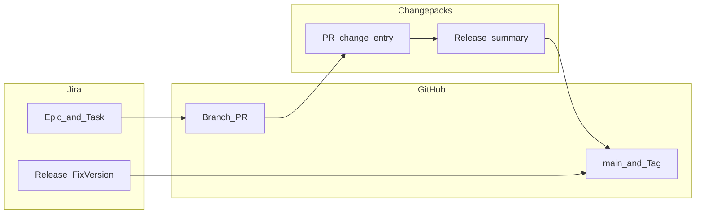

# Jira·GitHub·Changepacks 연계: 개발 계획부터 배포까지 가이드

**범위**: 특정 제품·프로젝트 코드명에 한정하지 않고, **이슈 추적(Jira)**·**저장소·PR(GitHub)**·**변경 기록(Changepacks)**를 같은 흐름으로 묶어 **기획 → 구현 → 릴리즈 → 운영 반영**까지 추적 가능하게 만드는 공통 기준이다.

## 목차

**핵심 요약**

- [핵심 연계 개요 (Planning through Release)](#핵심-연계-개요-planning-through-release)

**팀원을 위한 요약**

- [0. 이 문서를 쓰는 이유 (Why This Guide)](#0-이-문서를-쓰는-이유-why-this-guide)
- [1. 우리가 추구하는 것 (What We Aim For)](#1-우리가-추구하는-것-what-we-aim-for)
- [2. 이렇게 관리할 때의 이점 (Benefits in Practice)](#2-이렇게-관리할-때의-이점-benefits-in-practice)
- [3. 업무 방식이 어떻게 바뀌는가 (Day-to-Day Changes)](#3-업무-방식이-어떻게-바뀌는가-day-to-day-changes)

**상세 규칙 (참고)**

- [4. 현행 문제점 (Current Pain Points)](#4-현행-문제점-current-pain-points)
- [5. 에픽(Epic) 및 태스크(Task) 재구조화 원칙](#5-에픽epic-및-태스크task-재구조화-원칙)
  - [5.1 목적 중심의 에픽 분리](#51-목적-중심의-에픽-분리-functional-grouping)
  - [5.2 시기 정보의 라벨화](#52-시기-정보의-라벨화-labeling-strategy)
  - [5.3 단일 제품·이니셔티브와 서브태스크](#53-단일-제품이니셔티브와-서브태스크-single-product-initiative)
- [6. 버전 관리 전략 (Versioning Strategy)](#6-버전-관리-전략-versioning-strategy)
  - [6.1 버전 번호 체계](#61-버전-번호-체계-semantic-versioning)
  - [6.2 Git Tag 규칙](#62-git-tag-규칙)
  - [6.3 브랜치 전략](#63-브랜치-전략-branch-strategy)
  - [6.4 Hotfix 프로세스](#64-hotfix-프로세스)
  - [6.5 브랜치 보호 규칙](#65-브랜치-보호-규칙-branch-protection-rules)
  - [6.6 Jira Release와 Git Tag 연동](#66-jira-release와-git-tag-연동)
  - [6.7 롤백 전략](#67-롤백-전략-rollback-strategy)
- [7. GitHub–Jira 연동 및 Changepacks 규칙](#7-githubjira-연동-및-changepacks-규칙)
  - [7.1 브랜치 및 PR 관리](#71-브랜치-및-pr-관리)
  - [7.2 Changepacks 작성 가이드](#72-changepacks-작성-가이드)
- [8. 자동화·분석 도구 활용 시 예시 미션](#8-자동화분석-도구-활용-시-예시-미션)
- [부록: 실행 프롬프트 예시](#부록-실행-프롬프트-예시)

---

## 핵심 연계 개요 (Planning through Release)

**한 줄 요약**: Jira의 **에픽·태스크·릴리즈(Fix Version)**가 GitHub의 **브랜치·PR·머지 대상 브랜치**와 맞물리고, PR마다 쌓인 **Changepacks**가 **릴리즈 노트·Git Tag 메시지**로 이어지면, “어떤 계획이 어떤 코드로, 언제 운영에 반영됐는지”를 같은 식별자 체계로 설명할 수 있다.

| 단계 | Jira | GitHub | Changepacks |
|------|------|--------|-------------|
| **계획·범위** | 에픽·스토리·태스크로 목적 단위 정리, 기간은 Label | (브랜치 전) 이슈 키를 작업 단위로 사용 | — |
| **구현** | 태스크 상태·담당 | `type/이슈키-요약` 브랜치, PR, 리뷰 | PR마다 `npx changepacks add`로 변경 요약 |
| **통합** | — | `develop` → `release/*` → `main` (팀 전략에 맞게 적용) | 릴리즈 후보 변경분 집계 |
| **배포·기록** | Release·Fix Version·Released 상태 | 운영 반영 시 SemVer **Tag** on `main` | Tag 메시지·릴리즈 노트 재료 |



아래 0~3절은 이 연계를 **왜** 쓰고 **무엇이 달라지는지**를 짧게 정리하고, 4절 이하는 **동일 내용의 상세 규칙**이다.

---

## 0. 이 문서를 쓰는 이유 (Why This Guide)

브랜치가 과도하게 쌓이고, 기본 브랜치 대비 뒤처진 커밋이 불어나며, Git Tag 없이 운영이 올라간 경우가 반복되면 **증상**으로 나타나는 것은 다음과 같다: 머지 여부 판단이 어렵고, “지금 서버에 어떤 코드가 올라가 있지?”를 저장소만으로 답하기 힘들며, Jira 한 에픽 안에 성격이 다른 일이 섞여 **진척·우선순위·릴리즈 단위**가 흐려진다.

이 가이드는 규칙을 늘리기 위한 문서가 아니라, **계획(Jira)·구현(GitHub)·변경 기록(Changepacks)·배포 기준점(Tag·Release)**이 서로 짝을 이루게 하여 팀 전체의 추적 비용을 줄이기 위한 기준이다. 1~3절은 팀 배포 시 **먼저 읽는 요약**이고, 4절 이하는 **운영·온보딩용 상세 규칙**이다.

---

## 1. 우리가 추구하는 것 (What We Aim For)

- **배포와 이슈의 대응**: 운영에 나간 단위가 Git Tag·Jira Release·Fix Version으로 묶여, “어떤 티켓이 언제 반영됐는지”를 찾을 수 있게 한다.
- **에픽은 기능·가치 단위**: “신규 업무”, “분기 수정”처럼 바구니에 넣지 않고, 시스템에 미치는 영향이 비슷한 일끼리 에픽을 나눈다. (상세: [5절](#5-에픽epic-및-태스크task-재구조화-원칙))
- **브랜치·PR은 티켓과 짝**: 브랜치 이름에 이슈 키(Jira 등)를 넣고, 머지 후 불필요한 헤드 브랜치를 남기지 않아 원격 저장소를 “작업 중인 것” 위주로 유지한다. (상세: [7.1절](#71-브랜치-및-pr-관리))
- **변경 설명은 Changepacks + 릴리즈 요약**: PR마다 변경의 한 줄 요약을 남겨, 모이면 릴리즈 노트·Tag 메시지의 재료가 되게 한다. 조직·저장소에서 정한 **민감·감사 대상 패키지**(예: `evidence` 등)는 Changepack 없이 머지하지 않는다. (상세: [7.2절](#72-changepacks-작성-가이드))
- **기간·분기는 라벨로**: 에픽 이름에 분기만 박지 않고, 이슈 Label로 `2026_1Q` 등을 써서 필터한다. (상세: [5.2절](#52-시기-정보의-라벨화-labeling-strategy))
- **운영 반영에만 Tag**: 개발·스테이징마다 Tag를 찍지 않고, **운영 반영이 확정된 시점**에 SemVer Tag로 기준점을 남긴다. (상세: [6절](#6-버전-관리-전략-versioning-strategy))
- **핫픽스·롤백도 같은 언어**: 긴급 수정은 `hotfix/`와 PATCH Tag, 필요 시 이전 Tag 기준 롤백으로 말이 통하게 한다. (상세: [6.4절](#64-hotfix-프로세스), [6.7절](#67-롤백-전략-rollback-strategy))

---

## 2. 이렇게 관리할 때의 이점 (Benefits in Practice)

과장 없이, **추가로 하는 행동(티켓·브랜치·한 줄 changepack·라벨)**에 비해 무엇이 나아지는지 역할별로 정리한다.

| 관점 | 줄어드는 것 | 가능해지는 것 |
|------|-------------|----------------|
| **개발자** | “내 브랜치 이름이 뭐였지”, 오래된 브랜치와의 불필요한 동기화, 동료에게 “이 PR 뭐 하는 건지” 반복 설명 | 이슈 키만으로 브랜치·PR을 찾고, 머지 후 로컬·원격 정리 부담 감소(자동 삭제), 필수 패키지 변경 시 누락 방지 |
| **리뷰어·기술 리드** | 거대 에픽·무제목 PR에서 범위를 추측하는 시간 | PR·Changepacks 한 줄로 변경 의도 파악, 보호 브랜치·CI로 최소 품질선 유지 |
| **PM·기획** | “이번에 뭐 나갔어요?”를 커밋 로그로만 역추적 | Jira Release·Fix Version·Tag로 **릴리즈 단위** 보고·고객 공지 재료 확보 |
| **운영·장애 대응** | “어느 시점 코드인지” 불명확으로 인한 추측 배포 | Tag·이전 빌드·롤백 절차(및 DB down migration 준비)로 **기준점** 명시 |

자동화가 모든 판단을 대신하지는 않는다. 대신 **같은 규칙으로 말하면** 회의·메신저·장애 대응에서 합의가 빨라진다.

---

## 3. 업무 방식이 어떻게 바뀌는가 (Day-to-Day Changes)

아래는 **일상 플로우** 기준 Before → After이다. 세부는 [6절](#6-버전-관리-전략-versioning-strategy)·[7절](#7-githubjira-연동-및-changepacks-규칙)을 따른다. 이슈 키는 `PROJ-123` 형식의 **예시**이며, 실제 프로젝트 키로 바꿔 적용한다.

| 단계 | Before (피하고 싶은 패턴) | After (가이드에 맞춘 패턴) |
|------|---------------------------|----------------------------|
| **이슈 만들기** | “요청처리”, “분기 수정” 같은 큰 에픽에만 태스크 추가 | 목적이 다른 일은 에픽을 나누고([5.1절](#51-목적-중심의-에픽-분리-functional-grouping)), 분기·스프린트는 Label로 표시([5.2절](#52-시기-정보의-라벨화-labeling-strategy)) |
| **브랜치** | 임의 이름·티켓 없음·장기 방치 | `feat/PROJ-123-feature-summary`처럼 `type/이슈키-요약`([7.1절](#71-브랜치-및-pr-관리)) |
| **PR 올리기** | 설명 비어 있음, 변경 이력이 PR마다 남지 않음 | `npx changepacks add`로 `[PROJ-123] …` 형식 한 줄([7.2절](#72-changepacks-작성-가이드)); 필수 패키지 수정 시 changepack 필수 |
| **머지 후** | 원격에 헤드 브랜치 잔존 | GitHub “Automatically delete head branches”로 정리([7.1절](#71-브랜치-및-pr-관리)) |
| **통합·출시** | main에 직접 푸시·브랜치 역할 혼재 | `develop` → `release/vX.Y` → `main` 흐름, 보호 규칙·Approve([6.3절](#63-브랜치-전략-branch-strategy), [6.5절](#65-브랜치-보호-규칙-branch-protection-rules)) |
| **운영 반영** | Tag 없이 “대충 최신” | 운영 반영 확정 시에만 `v1.3.0` Tag; Jira Release·Fix Version과 이름 맞추기([6.1절](#61-버전-번호-체계-semantic-versioning), [6.2절](#62-git-tag-규칙), [6.6절](#66-jira-release와-git-tag-연동)) |
| **긴급 수정** | main에서 임시로 막 수정 | `hotfix/PROJ-123-…` → main + develop 역머지, PATCH Tag([6.4절](#64-hotfix-프로세스)) |

**부록**의 프롬프트는 일상 개발의 **필수 절차가 아니라**, 대량 정리·초기 태깅·릴리즈 매핑을 도울 때 쓰는 **자동화·분석 보조**용 예시다. ([부록](#부록-실행-프롬프트-예시))

---

## 4. 현행 문제점 (Current Pain Points)

| 구분 | 설명 |
|------|------|
| **바구니형 에픽 (Bucket Epics)** | 신규 업무, 요청 처리, 분기별 수정 등 기간·카테고리 중심 에픽에 서로 무관한 태스크가 혼재함. |
| **유령 브랜치 (Stale Branches)** | 이슈 티켓과 연결되지 않았거나, 작업 종료 후에도 삭제되지 않은 브랜치가 난립함. |
| **배포 기록 부재 (Zero Tags)** | Git Tag 관리가 없어 운영 반영 코드의 의도·시점 파악이 어려움. |

---

## 5. 에픽(Epic) 및 태스크(Task) 재구조화 원칙

에픽·태스크 정리를 자동화 도구나 스크립트로 돌릴 때도 아래 원칙을 기준으로 삼는다.

### 5.1 목적 중심의 에픽 분리 (Functional Grouping)

포괄적 명칭 대신 **실제 시스템·사용자 가치**를 기준으로 에픽을 나눈다. 조직에 맞게 접두사를 조정할 수 있다.

**권장 접두사 (예시)**

| 접두사 | 용도 |
|--------|------|
| `[FEAT]` | 신규 기능 개발 |
| `[REANALYSIS]` | 재분석·재처리 로직 (해당 도메인이 있을 때) |
| `[DATA]` | 데이터 정합성 및 DB·파이프라인 |
| `[INFRA]` | 성능, CI/CD, 인프라·파이프라인 개선 |
| `[OP/ADMIN]` | 행정, 회의, 피드백 등 비기술적 작업 |

### 5.2 시기 정보의 라벨화 (Labeling Strategy)

- 에픽 이름에서 `2026 1Q`와 같은 **기간 정보는 제거**한다.
- 대신 **모든 하위 이슈의 Label**에 `2026_1Q` 등을 등록하여 필터링 효율을 높인다.
- 같은 맥락에서 **제품·이니셔티브 식별**도 라벨로 둘 수 있다 (예: `data_ocean`). 에픽을 나중에 쪼개도 횡단 검색이 유지된다.

### 5.3 단일 제품·이니셔티브와 서브태스크 (Single product initiative)

하위 작업이 **성격은 다르지만 동일 제품·이니셔티브**(예: 전사 샘플 DB / Data_Ocean)에 속하는 경우, “포괄 유지보수”형 바구니와 구분하여 아래를 적용한다.

1. **이름으로 정체성 명시**  
   에픽 제목·설명에 **공식 제품명 또는 이니셔티브명**을 넣어, 필터·검색·온보딩에서 “무슨 제품의 일인지”가 바로 드러나게 한다. (예: 제목에 `Data_Ocean`을 포함하거나 부제로 고정.)

2. **축(트랙) 나누기: 하위 에픽 또는 라벨**  
   적재·스키마, 변경 감지·동기화, 외부 시스템 연동(SIMS/LIMS 등), 열람·UI 같은 **줄기**는 다음 중 팀에 맞는 방식으로 드러낸다.  
   - **하위 에픽**을 두고 신규 작업은 하위 에픽에만 붙인다. 상위 에픽은 컨테이너로 두고 **직접 자식 추가를 제한**하는 것이 좋다.  
   - 또는 에픽은 하나로 유지하고 **Label·컴포넌트**로 트랙을 나누어 대시보드·보드를 분리한다.

3. **서브태스크(하위 작업)의 역할**  
   서브태스크는 **하나의 작업(스토리/작업) 티켓 안**에서 “구현 / 문서 / 배포 확인” 등 **같은 완료 정의를 쪼갤 때** 쓴다.  
   **트랙 전체**나 **릴리즈 단위**를 서브태스크만으로 표현하면 보드·통계·에픽 보고에서 가시성이 떨어질 수 있으므로, 줄기 수준 구분에는 하위 에픽 또는 라벨을 우선한다.

4. **스킬·자동 분석과의 관계**  
   `epic-structure-analyzer` 등 도구는 `task_count > 30`일 때 기계적으로 바구니 신호를 낼 수 있다. 이 경우에도 에픽 설명상 목적이 **단일 프로그램**이면 “포괄형 바구니”와 **“프로그램형 과밀”**을 구분해 조치(명명·라벨·하위 에픽)를 제안한다.

---

## 6. 버전 관리 전략 (Versioning Strategy)

### 6.1 버전 번호 체계 (Semantic Versioning)

`MAJOR.MINOR.PATCH` 형식을 따른다.

| 구분 | 기준 | 예시 |
|------|------|------|
| **MAJOR** | 하위 호환이 깨지는 변경 (API 변경, DB 스키마 전면 수정 등) | `2.0.0` |
| **MINOR** | 하위 호환을 유지하는 신규 기능 추가 | `1.3.0` |
| **PATCH** | 버그 수정, 소규모 개선 | `1.3.1` |

> **운영 환경 반영 시에만 Tag를 생성한다.** 개발·스테이징 배포에는 Tag를 생성하지 않는다.

### 6.2 Git Tag 규칙

| 항목 | 규칙 |
|------|------|
| **Tag 형식** | `v{MAJOR}.{MINOR}.{PATCH}` (예: `v1.3.0`) |
| **Tag 생성 시점** | `main` 브랜치 Merge 완료 후 즉시 |
| **Tag 메시지** | Changepacks 릴리즈 요약문을 자동 첨부 |
| **Pre-release** | `v1.3.0-rc.1` 형식으로 RC(Release Candidate) 구분 |

```bash
# Tag 생성 예시 (이슈 키는 프로젝트에 맞게 교체)
git tag -a v1.3.0 -m "[v1.3.0] 수집기 병렬화, 재분석 로직 개선 (PROJ-100, PROJ-105)"
git push origin v1.3.0
```

### 6.3 브랜치 전략 (Branch Strategy)

```
main          ← 운영 배포 전용. 직접 Push 금지.
  ↑ merge
release/v1.3  ← 출시 준비 브랜치 (QA, RC 빌드)
  ↑ merge
develop       ← 통합 개발 브랜치
  ↑ merge
feat/PROJ-123 ← 개발자 작업 브랜치 (이슈 키)
```

| 브랜치 | 규칙 |
|--------|------|
| `main` | 직접 Push 금지. `release/*` 브랜치로부터 PR Merge만 허용. Tag 자동 생성 트리거. |
| `develop` | `feat/`, `fix/`, `data/` 등 작업 브랜치의 통합 대상. |
| `release/vX.Y` | 출시 직전 생성. QA 완료 후 `main` 및 `develop`에 역머지. |
| `hotfix/PROJ-123-요약` | `main`에서 분기. 수정 후 `main`과 `develop` 양쪽에 Merge. |

### 6.4 Hotfix 프로세스

긴급 운영 패치가 필요한 경우:

1. `main` 기준으로 `hotfix/PROJ-{ID}-내용` 브랜치 생성
2. 수정 후 PR → `main` Merge → **PATCH** 버전 Tag 생성 (예: `v1.3.0` → `v1.3.1`)
3. 동일 내용을 `develop`에도 즉시 역머지(Back-merge)
4. Jira 티켓 상태를 **Hotfix Released** 등 팀 규칙에 맞게 업데이트

### 6.5 브랜치 보호 규칙 (Branch Protection Rules)

GitHub Repository Settings에서 아래를 적용한다:

| 대상 브랜치 | 설정 |
|-------------|------|
| `main` | PR 필수 / 1인 이상 Approve 필수 / CI 통과 필수 / 직접 Push 금지 / Force Push 금지 |
| `develop` | PR 필수 / CI 통과 필수 |
| `release/*` | PR 필수 / 2인 이상 Approve 필수 |

### 6.6 Jira Release와 Git Tag 연동

1. Jira **Releases(버전) 보드**에 Git Tag와 동일한 버전명 등록 (예: `v1.3.0`)
2. 해당 릴리즈에 포함된 모든 티켓을 **Fix Version** 필드에 지정
3. 운영 배포 완료 후 Jira 릴리즈 상태를 **Released**로 변경
4. 자동화 가능 시: GitHub Release 생성 → Jira Automation Rule로 연계 Fix Version 업데이트

### 6.7 롤백 전략 (Rollback Strategy)

| 상황 | 대응 |
|------|------|
| **배포 직후 Critical 오류** | 이전 Tag로 재배포 (`git checkout v1.2.9` 기반 핫픽스 또는 이전 빌드 아티팩트 직접 롤백) |
| **DB 마이그레이션 포함 배포** | 마이그레이션 롤백 스크립트(down migration) 사전 준비 필수 |
| **롤백 기록** | 롤백 발생 시 Jira에 `[ROLLBACK]` 레이블 이슈 생성 후 원인 추적 |

---

## 7. GitHub–Jira 연동 및 Changepacks 규칙

개발 프로세스 전반에서 아래 규칙을 준수하도록 가이드한다. 이슈 키는 Jira를 가정하되, 동일 패턴을 다른 이슈 트래커에도 이식할 수 있다.

### 7.1 브랜치 및 PR 관리

| 항목 | 규칙 |
|------|------|
| **브랜치 이름** | `type/이슈키-내용` 형식 (예: `feat/PROJ-123-parallel-ingest`) |
| **자동 삭제** | PR Merge 시 GitHub 설정 *Automatically delete head branches*에 따라 헤드 브랜치 즉시 삭제 |
| **Hard Block** | 저장소 정책으로 정한 패키지(예: 감사·규제 대상 `evidence` 등) 수정 시 Changepack JSON이 없으면 머지 차단 |

### 7.2 Changepacks 작성 가이드

1. PR 생성 시 `npx changepacks add`로 명세서를 작성한다.
2. **작성 규격**: `[이슈키] 요약 내용`
   - 예: `[PROJ-123] 수집기 병렬화로 처리량 개선`
3. 자동화·분석 도구는 코드 변경분을 요약해 위 규격에 맞는 문구를 생성·제안할 수 있다.

---

## 8. 자동화·분석 도구 활용 시 예시 미션

특정 도구명에 묶지 않고, **구조 정리·릴리즈 준비**를 자동화할 때 수행할 수 있는 작업 유형의 예이다. 실제 티켓 키·저장소 상태에 맞게 바꾼다.

| 미션 | 내용 |
|------|------|
| **에픽 클리닝 (Epic Cleaning)** | 포괄적·바구니형 에픽에 묶인 태스크를 [5.1절](#51-목적-중심의-에픽-분리-functional-grouping) 원칙에 따라 신규 에픽 후보로 재분류 |
| **브랜치 매칭 및 정리 (Cleanup)** | 원격 브랜치를 스캔해 Stale·Behind가 큰 브랜치에 대한 삭제 권고 목록 작성 |
| **배포 요약문 생성 (Release Note)** | 머지 대기 PR에 대해 Changepacks 표준 규격에 맞는 요약문 초안 작성 |
| **버전 현황 분석 (Version Audit)** | 기존 운영 이력 기반으로 초기 MAJOR.MINOR 버전 제안 및 첫 Git Tag 메시지 초안 |
| **Jira Release 매핑 (Release Mapping)** | 완료·머지된 티켓을 분석해 Jira Releases 보드의 버전별 Fix Version 일괄 지정안 제시 |

---

## 부록: 실행 프롬프트 예시

일상 개발의 필수 절차가 아니라, **대량 정리·초기 태깅·릴리즈 매핑** 등을 도울 때 참고하는 예시다. 프로젝트 키·에픽 키는 본인 환경에 맞게 바꾼다.

**에픽 재구조화**

> 첨부한 [Jira·GitHub·Changepacks 연계 가이드] 마크다운을 읽고 우리 저장소·Jira를 기준으로 분석해줘. 우선 `PROJ-500` 에픽에 속한 태스크들을 5.1절 원칙에 따라 기능 중심 에픽 후보로 나누고, 어떤 태스크를 어디로 옮길지 표로 정리해줘.

**초기 버전 태깅**

> 현재 `main` 브랜치의 배포 이력과 완료된 Jira 티켓을 분석해서 초기 버전 번호(예: v1.0.0)를 제안하고, 첫 Git Tag 메시지에 들어갈 릴리즈 요약문을 작성해줘.

**Jira Release 매핑**

> 지난 3개월간 Done 상태인 우리 프로젝트 티켓 목록을 분석해서, 6.1절 SemVer 기준에 따라 어떤 티켓이 MINOR 릴리즈에 해당하고 어떤 티켓이 PATCH에 해당하는지 분류하고, Jira Releases 보드에 등록할 버전 구조를 제안해줘.
