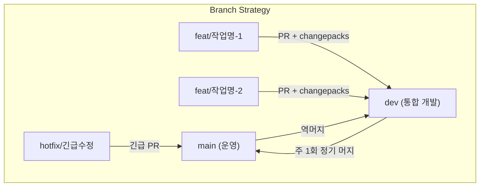
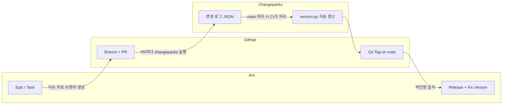

# EVIDENCE 개발 프로세스 개선 제안

## 목차

1. [현황 및 문제점 (AS-IS)](#1-현황-및-문제점-as-is)
2. [개선 방향 (TO-BE)](#2-개선-방향-to-be)
3. [Changepacks 도입 및 데모](#3-changepacks-도입-및-데모)

---

## 1. 현황 및 문제점 (AS-IS)

현재 EVIDENCE 프로젝트는 Task 단위로 작업이 진행되고 있으며, 아래 5가지 핵심 문제가 반복되고 있다.

### 1-1. 작업 사이즈 기준 부재

> "같은 에픽인데 어떤 사람은 하위작업 20개, 어떤 사람은 상위 작업 1개"

- 에픽/태스크의 크기가 작업자마다 다르다.
- 하위작업을 세분화하는 사람, 상위 작업을 새로 만드는 사람이 혼재한다.
- 에픽 사이즈가 제각각이라 Jira 보드만으로 **업무 진행 상황 파악이 어렵다**.
- "이 작업을 언제 완료했는가"를 추적하기 극히 어렵다.

### 1-2. 끝나지 않는 Jira 에픽

> "신규 업무", "요청 처리", "분기별 수정" — 바구니형 에픽

- 기간·카테고리 중심의 포괄적 에픽에 서로 무관한 태스크가 계속 추가된다.
- 에픽이 완료되지 않고 영구적으로 열려있어 진척률이 무의미하다.
- 새 작업이 들어오면 기존 에픽에 넣어버리므로 **범위(scope)가 무한히 확장**된다.

### 1-3. GitHub와 Jira의 연동 부재

> "이 PR이 어떤 Jira 이슈랑 관련이 있지?"

- 브랜치 이름에 이슈 키가 없고, PR과 Jira 티켓이 연결되지 않는다.
- 코드 변경과 업무 이슈의 추적이 분리되어 있어, 리뷰어나 PM이 맥락을 파악하려면 직접 물어봐야 한다.
- 머지된 브랜치가 원격에 남아 어떤 것이 진행 중인지 구분이 안 된다.

### 1-4. 배포 = 하나의 Jira 이슈

> "배포했습니다" — 그게 끝

- 배포 행위 자체가 하나의 Jira 이슈로만 관리된다.
- 어떤 기능이 포함되었는지, 어떤 버그가 수정되었는지 배포 기록에 남지 않는다.
- Git Tag가 없어 **운영에 올라간 코드의 시점**을 특정할 수 없다.

### 1-5. 추적 불가능

위 문제들이 결합되면:

| 질문 | 현재 답변 가능 여부 |
|------|---------------------|
| "지금 운영 서버에 어떤 버전이 올라가 있지?" | X — Tag 없음 |
| "이 기능은 언제 배포됐지?" | X — 배포와 기능의 연결 없음 |
| "이번 릴리즈에 뭐가 포함됐지?" | X — 릴리즈 단위 없음 |
| "이 버그는 어떤 커밋에서 생겼지?" | △ — 수동으로 커밋 로그 추적 |
| "롤백해야 하면 어디로 돌아가야 하지?" | X — 기준점 없음 |

### 현행 버전 관리의 구체적 문제

`version.py`의 숫자를 작업자가 **수동으로** 수정하는 방식:

```
PR1 에서 v5.3.2로 버전 업
PR2 에서 v5.4.0으로 버전 업

→ PR2가 먼저 머지, PR1이 나중에 머지
→ PR1 작업자가 PR2의 버전 업을 놓치면
→ v5.4.0 → v5.3.2 로 다운그레이드 발생
```

현재는 CI 알림으로 version.py를 읽어 메시지를 보내지만, **알림일 뿐 자동화가 아니다**.

---

## 2. 개선 방향 (TO-BE)

### 2-1. SDD (Spec Driven Development) 도입

작업 전 **스펙 문서**를 기반으로 범위를 사전에 합의한다.

| 항목 | Before | After |
|------|--------|-------|
| 작업 범위 | 구두 공유, 사람마다 해석 상이 | 스펙 문서로 범위 명시 |
| 에픽 크기 | 제한 없음 (바구니형) | 합의된 기간 내 완료 가능한 단위 |
| 완료 기준 | 모호 | 스펙에 정의된 기능 = Done |

### 2-2. 에픽 단위 표준화

- 에픽은 **기능·가치 단위**로 분리 (목적 중심)
- 기간 정보(2026_1Q 등)는 에픽 이름이 아닌 **Label**로 관리
- 하나의 에픽은 **정해진 기간 내에 완료**된다

```
[Before]                          [After]
"2026 1Q 신규 업무" (에픽)         "[FEAT] SNV 분석기 v2 리팩토링" (에픽)
  ├── SNV 관련 작업                  ├── SnvAnalyzer 클래스 전환
  ├── CNV 관련 작업                  ├── API 시그니처 변경
  ├── 파이프라인 관련 작업           └── 마이그레이션 가이드 작성
  └── 기타 요청 처리                 Label: 2026_1Q
```

### 2-3. 버저닝 도입과 브랜치 분리



| 브랜치 | 역할 | 규칙 |
|--------|------|------|
| `main` | 운영 배포 | 직접 Push 금지. 버전 태그 자동 생성 |
| `dev` | 통합 개발 | changepacks JSON 누적. PR 필수 |
| `feat/*` | 개인 작업 | dev에서 분기, dev로 머지 |
| `hotfix/*` | 긴급 수정 | main에서 분기, main으로 머지 후 dev 역머지 |

### 2-4. 추적 가능한 연계 구조



**"어떤 계획이 → 어떤 코드로 → 언제 운영에 반영됐는지"를 같은 식별자로 추적 가능**

| 질문 | TO-BE 답변 |
|------|-----------|
| "운영 서버 버전은?" | `git tag -l` → evidence-v3.0.0, pipeline-v1.0.3 |
| "이 기능은 언제 배포됐지?" | Git Tag + Jira Fix Version으로 추적 |
| "이번 릴리즈에 뭐가 포함됐지?" | Changepacks 릴리즈 노트 자동 생성 |
| "롤백 기준점은?" | 이전 Tag로 재배포 (예: evidence-v2.0.1) |

---

## 3. Changepacks 도입 및 데모

### 3-1. 도구 선정 배경

EVIDENCE는 Python 기반이며 dev 브랜치가 분리된다. 아래 3가지 후보를 검토했다:

| 구분 | Changesets (SW팀 사용) | Changepacks | Python Semantic Release |
|------|----------------------|-------------|------------------------|
| 언어 | JS/Node.js 필수 | Rust 기반, 언어 무관 | Python |
| 버전 판단 | 사람 (명령어) | 사람 (명령어) | 기계 (커밋 메시지) |
| 기준 데이터 | `.changesets/*.json` | `.changepacks/*.json` | Conventional Commits |
| 자율성 | 유연 | 유연 | 규칙 강제 필요 |
| 난이도 | 낮음 (단, Node 필요) | **낮음** | 높음 (팀 전체 커밋 규칙) |
| 패키지별 버전 | 지원 | **지원** | 미지원 |

**선정: Changepacks** — Node 불필요, `pip install changepacks`로 설치, 패키지별 버전 관리 지원.

### 3-2. 작업자 사용법

```bash
# 1. 개인 브랜치에서 코드 작업 후
git checkout -b feat/snv-quality-filter

# 2. 리뷰 완료 후 changepacks 실행
changepacks
```

실행하면 인터랙티브하게 선택:

```
? Select projects to update for Patch
  > [x] [Python] evidence (v3.0.0) - evidence/pyproject.toml
    [ ] [Python] pipeline (v1.0.3)  - pipeline/pyproject.toml

? Write your change note:
  fix: SnvAnalyzer genome_build 유효성 검증 추가
```

자동으로 `.changepacks/changepack_log_Gi_gYlDoFYHalbzPfyD4P.json` 생성:

```json
{
  "changes": { "evidence/pyproject.toml": "Patch" },
  "note": "fix: SnvAnalyzer genome_build 유효성 검증 추가",
  "date": "2026-03-25T08:25:24.639Z"
}
```

```bash
# 3. JSON 포함하여 커밋 & push
git add -A && git commit -m "fix: SNV genome_build 검증 추가"
git push -u origin feat/snv-quality-filter

# 4. GitHub에서 dev로 PR → merge
```

**핵심 원칙:**
- `version.py`는 **직접 수정하지 않는다** — CI가 갱신
- JSON 파일은 **예약권** — PR에 포함되지 않으면 버전이 올라가지 않는다
- 각자 다른 이름의 JSON이므로 **충돌 걱정이 없다**

### 3-3. CI 자동화 파이프라인

3개의 GitHub Actions 워크플로우가 동작한다:

```mermaid
flowchart TD
    subgraph pr_check [PR Changepacks Check]
        prTrigger["PR → dev 생성"]
        checkDirs["evidence_snv/, evidence_cnv/, pipeline/ 변경 확인"]
        checkJson["changepacks JSON 존재 확인"]
        block["Merge 차단"]
        pass["Merge 허용"]

        prTrigger --> checkDirs
        checkDirs -->|변경 있음| checkJson
        checkDirs -->|변경 없음| pass
        checkJson -->|JSON 없음| block
        checkJson -->|JSON 있음| pass
    end

    subgraph scheduled [Scheduled Merge]
        cron["5분 / 주 1회 스케줄"]
        diffCheck["dev vs main diff 확인"]
        createPR["dev → main PR 자동 생성"]

        cron --> diffCheck
        diffCheck -->|차이 있음| createPR
    end

    subgraph version_update [Version Update]
        mainPush["main에 push"]
        cpUpdate["changepacks update --yes"]
        syncVer["sync_version.py 실행"]
        commitTag["커밋 + Git Tag 생성"]
        backMerge["main → dev 역머지"]

        mainPush --> cpUpdate
        cpUpdate --> syncVer
        syncVer --> commitTag
        commitTag --> backMerge
    end
```



### 3-4. 테스트 시나리오 및 결과

실제 테스트 환경(`evi_version_test` 저장소)에서 아래 시나리오를 검증했다.

#### 시나리오 1-3: 여러 버전 등급 누적 → 최고 등급만 적용

3명의 작업자가 각각 Patch, Minor, Major를 dev에 누적한 상황:

| 작업자 | 변경 내용 | 버전 등급 | changepacks JSON |
|--------|----------|----------|-----------------|
| A | evidence_snv 버그 수정 (genome_build 검증) | Patch | `changepack_log_Gi_*.json` |
| B | evidence_cnv 요약 리포트 함수 추가 | Minor | `changepack_log_wM_*.json` |
| C | SnvAnalyzer config dict 방식으로 전면 변경 | **Major** | `changepack_log_Qa_*.json` |

**결과**: dev → main 머지 시 **가장 높은 등급(Major)만 적용**

```
evidence: v2.0.1 → v3.0.0  (Major bump)
pipeline: v1.0.1            (변경 없음)
```

Git Tag: `evidence-v3.0.0` 자동 생성

#### 시나리오 2: pipeline만 변경 → pipeline만 버전 업

| 항목 | 기대값 | 실제값 |
|------|--------|--------|
| PIPELINE_VERSION | v1.0.2 | **v1.0.2** |
| EVIDENCE_VERSION | v3.0.0 (유지) | **v3.0.0** |
| Git Tag | pipeline-v1.0.2 | **pipeline-v1.0.2** |

패키지별 독립 버전 관리가 정상 동작함을 확인.

#### 시나리오 4: 핫픽스 (main 직접 머지 + dev 역머지)

```
[시나리오 흐름]
main (v1.0.2) → hotfix/cnv-scoring-fix 분기
                  → 버그 수정 + changepacks Patch
                  → main으로 PR → merge
                  → CI: pipeline v1.0.3 + Tag + dev 역머지
```

| 확인 항목 | 결과 |
|-----------|------|
| Patch 버전만 올라감 | pipeline v1.0.2 → **v1.0.3** |
| Git Tag 생성 | **pipeline-v1.0.3** |
| main → dev 역머지 | **정상 동작** |

#### Merge Block 테스트 (시나리오 1-1)

`evidence_snv/`에 코드 변경이 있지만 changepacks JSON이 없는 PR:

```
→ Changepacks Check CI 실패
→ PR 머지 차단
→ changepacks 실행 후 JSON 추가 커밋
→ CI 재실행 → 통과 → 머지 가능
```

비추적 디렉토리(genet/ 등) 변경 시에는 changepacks 없이도 머지 허용.

### 3-5. 최종 버전 히스토리

테스트를 통해 생성된 전체 Git Tag 이력:

```
evidence-v1.1.0    # 시나리오 1: SNV Minor
evidence-v2.0.0    # 초기 테스트
evidence-v2.0.1    # 패키지 통합 후 첫 버전
evidence-v3.0.0    # 시나리오 1-3: Major bump (Patch+Minor+Major 누적)
evidence-v3.0.1    # 자동 역머지 시 생성

pipeline-v1.0.0    # 초기 버전
pipeline-v1.0.1    # 시나리오 1-3 과정 중 Patch
pipeline-v1.0.2    # 시나리오 2: QC step 추가
pipeline-v1.0.3    # 시나리오 4: 핫픽스
```

### 3-6. 패키지별 버전 관리 구조

EVIDENCE 프로젝트는 2개의 논리적 패키지로 버전을 분리 관리한다:

| 패키지 | 구성 디렉토리 | 버전 기준 파일 | 현재 버전 |
|--------|-------------|--------------|----------|
| **evidence** | evidence_snv/, evidence_cnv/ | `evidence/pyproject.toml` | v3.0.0 |
| **pipeline** | pipeline/ | `pipeline/pyproject.toml` | v1.0.3 |

`scripts/sync_version.py`가 `pyproject.toml`의 버전을 읽어 `version.py`로 동기화:

```python
# version.py (CI가 자동 갱신)
EVIDENCE_VERSION = "v3.0.0"
PIPELINE_VERSION = "v1.0.3"
```

---

## 요약

| 구분 | AS-IS | TO-BE |
|------|-------|-------|
| **작업 단위** | 사이즈 기준 없는 바구니형 에픽 | SDD 기반 범위 합의 + 완료 가능한 에픽 |
| **버전 관리** | version.py 수동 수정 | changepacks → CI 자동 업데이트 |
| **브랜치** | main 단일 브랜치 | main / dev / feat 분리 |
| **배포 추적** | 배포 = Jira 이슈 1개 | Git Tag + Jira Release + Fix Version 연계 |
| **충돌 위험** | PR 순서에 따라 버전 다운그레이드 가능 | JSON 파일 기반으로 충돌 없음 |
| **핫픽스** | 절차 없음 | main 분기 → Patch → 역머지 자동화 |
| **추적성** | "언제 뭐가 나갔지?" 답변 불가 | Tag + 릴리즈 노트로 즉시 확인 |

---

## 관련 문서

- [versioning_tool_first_docs.md](versioning_tool_first_docs.md) — 버저닝 도구 도입 배경 및 비교
- [jira_issue.md](jira_issue.md) — Jira + GitHub + Changepacks 연계 전체 가이드
- [README.md](README.md) — 테스트 환경 구성 및 시나리오 상세
