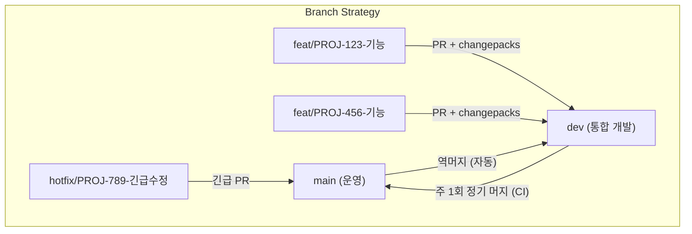

# EVIDENCE 개발 프로세스 개선 보고서

**작성일**: 2026-03-25  
**작성자**: 박정준  
**대상**: EVIDENCE 개발팀

---

## 1. 배경

EVIDENCE 프로젝트는 현재 main 단일 브랜치에서 Task 단위로 개발이 진행되고 있으며, 버전 관리는 작업자가 `version.py`를 수동으로 수정하는 방식이다. Jira와 GitHub 간 연동이 없고, 배포 단위의 추적 체계가 부재하여 "어떤 기능이 언제 운영에 반영되었는가"를 확인하기 어려운 상태가 지속되고 있다.

**현행 방식의 핵심 문제 5가지:**

| 문제 | 상세 |
|------|------|
| 작업 사이즈 기준 부재 | 에픽/태스크 크기가 사람마다 달라 업무 파악과 완료 시점 추적이 어려움 |
| 끝나지 않는 에픽 | "신규 업무", "분기별 수정" 같은 바구니형 에픽에 무관한 태스크가 무한히 추가됨 |
| GitHub-Jira 연동 부재 | 브랜치/PR과 Jira 티켓이 연결되지 않아 코드와 업무의 추적이 단절됨 |
| 배포 = Jira 이슈 1개 | 어떤 기능/버그 수정이 포함됐는지 배포 기록에 남지 않음 |
| 추적 불가 | 운영 서버 버전, 릴리즈 내용, 롤백 기준점을 특정할 수 없음 |

**버전 관리 구체적 위험:**

```
PR1: v5.3.2로 버전 업 / PR2: v5.4.0으로 버전 업
→ PR2 먼저 머지 후 PR1이 나중에 머지되면
→ v5.4.0 → v5.3.2로 다운그레이드 발생 가능
```

현재는 CI가 version.py를 읽어 알림을 보내지만 자동화가 아니라 수동 확인에 의존한다.

---

## 2. 목적

본 보고서는 EVIDENCE 프로젝트에 **SDD(Spec Driven Development)** 및 **Changepacks 기반 유의적 버저닝(Semantic Versioning)**을 도입하여 다음을 달성하고자 한다.

1. **작업 단위 표준화**: 에픽의 범위를 사전에 합의하고, 기간 내 완료 가능한 단위로 관리
2. **자동 버전 관리**: version.py 수동 수정을 제거하고, CI가 자동으로 버전 갱신 + Git Tag 생성
3. **브랜치 분리**: main / dev / feature 브랜치를 분리하여 운영 코드와 개발 코드를 명확히 구분
4. **추적 체계 구축**: Jira Release + Git Tag + Changepacks 릴리즈 노트를 연계하여 "계획 → 구현 → 배포"의 전 과정을 추적 가능하게 함

---

## 3. 결론

테스트 환경(`evi_version_test` 저장소)에서 4개 시나리오를 실행한 결과, **Changepacks + GitHub Actions 기반 자동 버저닝 체계가 정상 동작함을 확인**했다.

### 검증 결과 요약

| 시나리오 | 내용 | 결과 |
|----------|------|------|
| 1-3 | Patch + Minor + Major 누적 → 최고 등급만 적용 | evidence v2.0.1 → **v3.0.0** (Major) |
| 2 | pipeline만 변경 → pipeline만 버전 업 | pipeline v1.0.1 → **v1.0.2**, evidence 변경 없음 |
| 4 | 핫픽스: main 분기 → main 머지 → dev 역머지 | pipeline v1.0.2 → **v1.0.3** + 자동 역머지 |
| 1-1 | changepacks 없이 PR → 머지 차단 | CI 실패 → **머지 차단** 정상 동작 |

### 핵심 결론

- 작업자는 `changepacks` 명령어 **한 번만 실행**하면 된다. 나머지는 CI가 자동 처리한다.
- 여러 작업자의 변경이 누적되어도 **가장 높은 버전 등급 하나만** 적용된다.
- 패키지별(evidence / pipeline) **독립 버전 관리**가 가능하다.
- 추적 대상 디렉토리 변경 시 changepacks JSON이 없으면 **머지가 자동 차단**된다.

---

## 4. 실행 방안

### 4-1. Jira 에픽 구조 개선

| 항목 | Before | After |
|------|--------|-------|
| 에픽 단위 | 기간/카테고리 중심 바구니 | 기능/가치 단위 (목적 중심) |
| 기간 관리 | 에픽 이름에 "2026 1Q" 삽입 | Jira Label로 `2026_1Q` 등록 |
| 에픽 수명 | 영구 Open | 스펙 범위 완료 시 Close |

### 4-2. 브랜치 전략 도입



| 브랜치 | 역할 | Push 규칙 |
|--------|------|----------|
| `main` | 운영 배포 전용 | 직접 Push 금지, PR Merge만 허용 |
| `dev` | 통합 개발 | changepacks JSON 누적, PR 필수 |
| `feat/*` | 개인 작업 | dev에서 분기, dev로 머지 |
| `hotfix/*` | 긴급 수정 | main에서 분기, main 머지 후 dev 자동 역머지 |

### 4-3. Changepacks 도입

**설치:**

```bash
pip install changepacks
```

**작업자 플로우:**

```
코드 작업 → 리뷰 통과 → changepacks 실행 → JSON 커밋 → push → PR merge
```

**CI 자동화 (GitHub Actions 3개):**

| 워크플로우 | 트리거 | 동작 |
|-----------|--------|------|
| PR Changepacks Check | PR → dev | 추적 디렉토리 변경 시 JSON 존재 확인, 없으면 머지 차단 |
| Version Update | push → main | `changepacks update` + version.py 갱신 + Git Tag + dev 역머지 |
| Scheduled Merge | 주 1회 스케줄 | dev에 JSON이 있으면 dev → main PR 자동 생성 |

### 4-4. 도입 단계

| 단계 | 기간 | 내용 |
|------|------|------|
| **1단계** | 즉시 | 테스트 저장소에서 팀원 실습 + changepacks 사용법 공유 |
| **2단계** | 1~2주 | EVIDENCE.tucuxi 저장소에 dev 브랜치 생성 + CI 워크플로우 적용 |
| **3단계** | 2~4주 | 실제 개발에서 changepacks 사용 시작 + Jira 에픽 구조 정리 |
| **4단계** | 1개월 후 | Jira Release + Git Tag 연동, 릴리즈 노트 자동화 |

---

## 5. 결과 및 기대효과

### 역할별 기대효과

| 관점 | 줄어드는 것 | 가능해지는 것 |
|------|-------------|--------------|
| **개발자** | version.py 수동 수정, 버전 충돌 걱정, 브랜치 이름 혼란 | changepacks 한 번으로 버전 관리 완료, JSON 기반 무충돌 |
| **리뷰어** | 거대 PR에서 변경 범위 추측 | changepacks 노트로 변경 의도 즉시 파악 |
| **PM/기획** | "이번에 뭐 나갔어요?"를 커밋 로그로 역추적 | Jira Release + Git Tag로 릴리즈 단위 보고 |
| **운영/장애 대응** | "어느 시점 코드인지" 불명확 | Tag 기반 롤백, 기준점 명시 |

### 정량적 기대효과

| 항목 | AS-IS | TO-BE |
|------|-------|-------|
| 버전 다운그레이드 위험 | 있음 (PR 순서에 의존) | **제거** (CI 자동 관리) |
| 배포 추적 가능 여부 | 불가 | **Git Tag + 릴리즈 노트로 즉시 확인** |
| 롤백 소요 시간 | 커밋 로그 수동 추적 | **이전 Tag 기준 즉시 롤백** |
| version.py 충돌 | 발생 가능 | **0건** (JSON 파일 기반, 충돌 불가) |

### 테스트 결과로 검증된 항목

```
evidence-v1.1.0  → evidence-v2.0.0  → evidence-v2.0.1  → evidence-v3.0.0
pipeline-v1.0.0  → pipeline-v1.0.1  → pipeline-v1.0.2  → pipeline-v1.0.3
```

- 패키지별 독립 버전 관리 정상 동작
- 여러 등급 누적 시 최고 등급만 적용 (Patch + Minor + Major → Major)
- 핫픽스 → main 머지 → dev 역머지 자동화 검증 완료
- changepacks JSON 없이 추적 디렉토리 변경 시 머지 차단 확인

---

## 6. 알림 사항

### 필수 알림

- **changepacks 설치 필요**: cy2 서버에서 `pip install changepacks` 실행 (1회)
- **GitHub 저장소 설정 변경 필요**: Actions 권한 (Read and write + PR 생성 허용)
- **version.py 직접 수정 금지**: 도입 후 version.py는 CI가 관리하므로 수동 수정 시 다음 CI에서 덮어씌워짐

### 특이사항

- Changepacks는 `pyproject.toml` 파일 위치 기준으로 패키지를 인식한다. 현재 evidence_snv, evidence_cnv는 하나의 `evidence/pyproject.toml`로 통합 관리한다.
- 핫픽스 PR은 `dev`가 아닌 `main` 대상이므로, Changepacks Check CI는 동작하지 않는다 (체크 대상: dev PR만).

### 요청사항

1. 팀원 대상 changepacks 사용법 실습 세션 일정 확보 (30분)
2. EVIDENCE.tucuxi 저장소에 dev 브랜치 생성 승인
3. GitHub Actions 워크플로우 3개 적용 승인

### 첨부자료

| 문서 | 내용 |
|------|------|
| [changepacks_setup_guide.md](changepacks_setup_guide.md) | Changepacks 설정 방법 및 인터페이스 사용법 상세 가이드 |
| [presentation.md](presentation.md) | AS-IS/TO-BE 발표 자료 (다이어그램 포함) |
| [README.md](README.md) | 테스트 환경 구성 및 시나리오 상세 |
| [jira_issue.md](jira_issue.md) | Jira + GitHub + Changepacks 연계 전체 가이드 |
| [versioning_tool_first_docs.md](versioning_tool_first_docs.md) | 버저닝 도구 도입 배경 및 비교 |
| [테스트 저장소](https://github.com/Park-Jung-Joon/evi-version-test) | 시나리오 테스트 실행 이력 확인 가능 |
